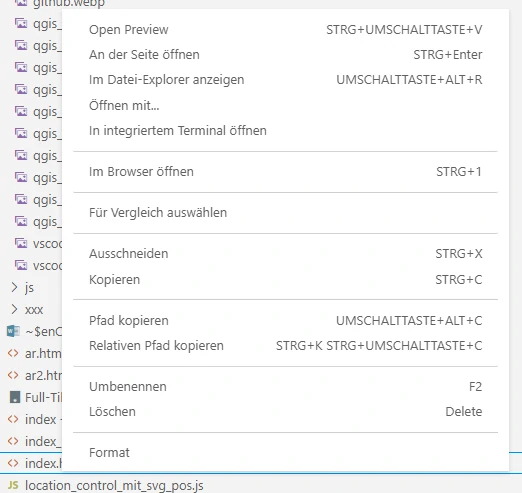
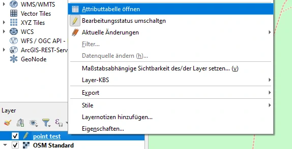

# Interessante Orte - Anleitung

Hier findest Du eine Beispielanwendung, die in Kooperation mit der [Geschichtswerkstatt Köln Mülheim](https://www.geschichtswerkstatt-muelheim.de/) erstellt wurde:

[MÜLHEIM IM NATIONALSOZIALISMUS - ORTE, DIE VON DIESER ZEIT ERZÄHLEN ](https://cologne.codefor.de/koeln_muelheim_ns_zeit/index.html)
* * *
Schritt für Schritt wirst Du eine einfache Kartenanwendung erstellen, mit der Du interessante Orte visualisieren kannst.

Besonderer Fokus liegt dabei auf:

* Freier Software
* Mobiler Nutzung
* Nachhaltigkeit
* Barrierefreiheit
* Datenschutzgrundverordnung (DSGVO)
* Suchmaschinen Indexierung

## Voraussetzungen

* moderner Browser
* QGIS
* Visual Studio Code

## Inhaltsverzeichnis

- [Interessante Orte - Anleitung](#interessante-orte---anleitung)
  - [Voraussetzungen](#voraussetzungen)
  - [Inhaltsverzeichnis](#inhaltsverzeichnis)
  - [Software installieren](#software-installieren)
  - [Entwicklungsumgebung installieren](#entwicklungsumgebung-installieren)
  - [Testanwendung](#testanwendung)
    - [Ort 1 - Standort Ost: Nachhaltiges Webdesign](#ort-1---standort-ost-nachhaltiges-webdesign)
    - [Ort 2 - Standort Süd: Bilder nachhaltig einbinden](#ort-2---standort-süd-bilder-nachhaltig-einbinden)
    - [Ort 3 - Standort West: Copyright, Urheberrecht und Lizenzen](#ort-3---standort-west-copyright-urheberrecht-und-lizenzen)
    - [Ort 4 - Standort Nord: Barrierefreiheit](#ort-4---standort-nord-barrierefreiheit)
    - [Ort 5 - Standort Jan-Wellem-Denkmal: externer Link](#ort-5---standort-jan-wellem-denkmal-externer-link)
  - [Geodaten erstellen mit QGIS](#geodaten-erstellen-mit-qgis)
  - [Anwendung anpassen](#anwendung-anpassen)
  - [Anwendung optimieren](#anwendung-optimieren)
  - [Anwendung auf einem Server laufen lassen](#anwendung-auf-einem-server-laufen-lassen)

## Software installieren

Einfach den Code als Zip Datei herunterladen, und in einem Ordner Eurer Wahl entpacken.

## Entwicklungsumgebung installieren

[Visual Studio Code](https://code.visualstudio.com) ist eine freie Entwicklungsumgebung.

Diese bitte zunächst installieren.

Dann mit dem Ordner des Projektes verbinden:

Für VS Code existieren zahlreiche Erweiterungen. Diese können über den Menüpunkt Erweiterungen hinzugefügt werden:

Benötigt wird die Erweiterung "Open In Default Browser".
Dadurch wird ein lokaler HTTP Server bereitgestellt.

Mit der rechten Maustaste im Explorer von VS Code auf die index.html Datei klicken und das Kontextmenü öffnen. Dort "Im Browser öffnen"  auswählen.

Jetzt sollte die Anwendung starten.

Weitere nützlich Erweiterungen wären:

* Prettier: automatische Formatierung
* ESLint: automatische Prüfung von Javascript Code

## Testanwendung

Wenn Du die Anwendung im Browser gestartet hast, kannst Du einzelne Orte mit der Maus anklicken.

An den Orten erfährst Du etwas zu verschiedenen Aspekten der Webentwicklung, welche hier besonders berücksichtigt wurden.

Eine Einführung zu HTML findest Du auf [SELFHTML](https://wiki.selfhtml.org/).

Wenn es auch in Englisch sein darf, ist die [W3School](https://www.w3schools.com/html/default.asp) auch eine gute Quelle.

Einen HTML Online Editor findest Du bei [html-online.com](https://html-online.com/editor/).

### Ort 1 - Standort Ost: Nachhaltiges Webdesign

Themen sind die Wahl Deines Providers, Verwendung von W3C Standards und der Dark Mode.

### Ort 2 - Standort Süd: Bilder nachhaltig einbinden

Lerne wie Bilder möglichst ressourcenschonend eingebunden werden können.

### Ort 3 - Standort West: Copyright, Urheberrecht und Lizenzen

Eine kleine Einführung in das Thema in Bezug auf diese Webanwendung.

### Ort 4 - Standort Nord: Barrierefreiheit

Umsetzung der Barrierefreiheit in dieser Anwendung.

### Ort 5 - Standort Jan-Wellem-Denkmal: externer Link

Direkter Aufruf eines externen Links in einem neuen Browsertab (siehe Geodaten erstellen mit QGIS).

## Geodaten erstellen mit QGIS

Eine aktuelle Version von [QGIS](https://www.qgis.org/de/site) installieren.

QGIS öffnen und zunächst rechts unten schauen, ob das [Koordinatenreferenzsystem](https://de.wikipedia.org/wiki/Koordinatenreferenzsystem) zu unseren späteren Webanwendung passt. Dort sollt EPSG:3857 stehen.

Falls dies nicht der Fall sein sollte, mit der linken Maustaste auf das EPSG Feld klicken und dann das gewünschte EPSG:3857 auswählen.

In dem Unterordner /geodata des Projektes befinden sich bereits zwei fertige Beispiele für Geometriedaten im GeoJson Format:

* Punktgeometrie für Orte: point.geojson
* Liniengeometrie für Routen: line.geojson

Diese können in QGIS direkt verwendet werden:

Layer --> Layer hinzufügen --> Vektorlayer hinzufügen ...

Dann die gewünschte Datei hinzuladen:

Was jetzt noch fehlt, sind die Hintergrundkarten von OpenStreetMap, um selber Orte einzuzeichnen.

Web --> QuickMapserverices --> OSM --> OSM Standard

Um die Geodaten zu bearbeiten, mit der rechten Maustaste auf den Layer klicken. Dann "Bearbeitungsstatus umschalten" auswählen:

Zunächst einmal alle alten Einträge im Geodatensatz löschen.
Dazu wieder mit der rechten Maustaste das Kontextmenü des Datensatzes aufrufen.
Dort "Attributtabelle öffnen" auswählen.

Die Objekte welche gelöscht werden sollen mit gedrückter "Strg" Taste und Mausklick auswählen. Dann über das Mülleimer Symbol löschen.

Dann das Fenster mit der tabellarischen Ansicht schließen (X rechts oben).

Um nun selbst Punkte hinzuzufügen, im Menü "Punktobjekt hinzufügen" aktivieren:

Zum Anlegen eines Ortes an den gewünschten Punkt mit der linken Maustaste klicken.

Die "id" ist nachher der Name der zugehörigen html Datei des Ortes, die wir später erstellen.

In das optionale Feld "beschriftung" können die Nummern der Stationen eingetragen werden.

Das Feld "externe_url" ist optional. Es muss nur ausgefüllt werden, wenn in der Kartenanwendung direkt eine externe Webseite aufgerufen werden soll.

Mittels der Pfeiltasten kann die Karte verschoben werden. Durch das Mausrad kann in der Karte gezoomt werden.

Wenn Ihr fertig seid mit Euren Punkten, den Bearbeitungsstatus wieder umschalten und die Änderungen speichern.

Das gleiche, könnt Ihr auch für die Liniengeometrie machen, wenn Ihr z.B. Euren Nutzer*innen eine feste Route anbieten wollt.

In diesem Falle dann "Linienobjekt hinzufügen" auswählen.

Fertig, jetzt kann QGIS wieder geschlossen werden.

Mittel des QGIS Plugins "GeoCoding" können Orte über die Adressen aus OpenStreetMap gesucht werden. Dies ist manchmal ganz praktisch.

Zur Installation: In der oberen Menüleiste --> Erweiterungen --> Erweiterungen verwalten und installieren --> nach GeoCoding suchen & installieren.

Die Erweiterung ist dann unter dem Menüpunkt Erweiterungen verfügbar.

## Anwendung anpassen

Jetzt geht es los. Im Ordner "html" befinden sich die Beispieldaten. Wenn Du die IDs in QGIS auch einfach mit Nummern vergeben hast, kannst Du einfach mit der Datei "1.html" anfangen. Wenn Du sprechende IDs vergeben hast wie z.B. "Meine_Erste_Seite" muss die HTML Datei entsprechend umbenannt werden. Im Menü von VS Code oben links:

Datei --> Speichern unter... --> Meine_Erste_Seite.html

Die neue HTML Seite muss wieder im Ordner "html" gespeichert werden.

Passe das HTML Dokument nach Deinen Wünschen an. Das Dokument enthält einige Kommentare als Hilfestellung.

Für die barrierefreie Version der Webseite muss die Seite barrierefrei.html angepasst werden. Hier nicht vergessen, auch die Links anzupassen.

Desweiteren müssen noch die folgenden Seiten angepasst werden:

* hilfe.html
* impressum_datenschutz.html

Das war es aber auch schon.

Wenn Ihr schauen wollt, wie sich Eure Seiten auf unterschiedlichen Endgeräten aussehen, könnt Ihr dies direkt im Browser testen.

In Chromium basierten Browsern (Chrome, Edge) dazu mit F12 die Entwicklerkonsole aufrufen. Links oben befindet sich das Icon "Gerätesymbolleiste ein- und ausblenden". Im Browserfenster können dann verschiedene Endgeräte ausgewählt werden. Es ist auch möglich, das Gerät zu drehen.

Im FireFox im Anwendungsmenü "Weitere Werkzeuge" auswählen. Dort "Bildschirmgrößen testen" aktivieren und loslegen.

Gerade bei den großen Überschriften kann es vorkommen, dass diese bei kleinen Smartphones nicht mehr in eine Zeile passen. Dann sollte mit einem bedingten Trennzeichen (\&shy\;) gearbeitet werden.
  
Die kleinsten Displays, die noch unterstützt werden sollten, haben 320 Pixel Breite.

## Anwendung optimieren

Unser Code enthält einige Kommentare. Außerdem wird durch VS Code Erweiterungen wie Prettier oder Beautify der Code recht ansprechend formatiert, enthält aber viele überflüssige Zeichen.

Mit Compressoren wie [htmlcompressor](https://htmlcompressor.com/compressor/) wird unser Code im Beispiel der index.html auf 45 % der Ursprungsgröße geschrumpft (siehe compress.html). Es geht also weniger über die Leitung, und schont unsere Ressourcen.

Dazu den Code Typ einstellen (HTML, CSS oder Javascript) und das Charset auf Unicode (UTF-8) einstellen.

Am besten den gesamten Projektordner einmal kopieren und dann die Originaldateien mit den komprimierten Daten ersetzen.

Noch besser wäre es, die einzelnen Javascript und CSS Dateien so weit wie möglich durch einen automatischen Build Prozess zusammenzuführen. Dies würde hier den Rahmen sprengen. Mehr Informationen dazu findet Ihr unter diesem [Artikel](https://opensource.com/article/20/11/javascript-build-tools). In diesem Falle ist da auch nicht allzu viel herauszuholen. Wo es sich wirklich lohnt, ist bei den Bildern.

Dies gilt natürlich, insbesondere für die Hintergrundkarten von OSM. Leider ist hier eine Anfrage mit einem kompakteren Bildformat momentan nicht möglich (Stand 1/2022). Eine andere interessante Möglichkeit wären [Verkorkacheln (Vector Tiles)](https://en.wikipedia.org/wiki/Vector_tiles)  als Hintergrundkarten. Die Daten werden hier paketiert an den Browser ausgeliefert, und dort dann gerendert. Es gehen also meist weniger Daten über die Leitung, dafür ist die Berechnung am Klienten aufwendiger. Dies ist besonders für mobile Geräte zu empfehlen, da hier zumeist die Bandbreite der Flaschenhals ist. Ob dabei aber auch tatsächlich Energie gespart wird, ist eine interessante Frage. [Openmaptiles.org](https://openmaptiles.org/) bietet für nicht kommerzielle Zwecke Vektorkacheln mit einem limitierten Abfragekontingent an. Es sind aber dazu auch noch weitere Anpassungen am Code erforderlich, dies ist der Webseite zu entnehmen.

## Anwendung auf einem Server laufen lassen

Achte bei der Wahl Deines Providers auf Ökostrom & Klimaneutralität.

Wenn es noch ein bisschen nachhaltiger sein darf, wähle eine Genossenschaft, wie z.B. [Cooperative Cloud Computing](https://www.hostsharing.net). Da steht nicht der Profit im Vordergrund, und es ist Platz für andere Werte.

Vorsicht mit kostenlosen Angeboten. Wenn es Dich nichts kostet, sind Deine Daten zumeist der Preis. Auch mit Anbietern im außereuropäischen Ausland ist es nicht unproblematisch, aufgrund der Datenschutzgrundverordnung.

Wenn Eure Anwendung [gemeinnützige Ziele](https://de.wikipedia.org/wiki/Gemeinn%C3%BCtzigkeit) verfolgt, und die Inhalte mit einer freien Lizenz versehen sind, könnt Ihr uns auch gerne bezüglich des Hostings kontaktieren.

[OK Lab Köln](https://www.codefor.de/koeln/)

